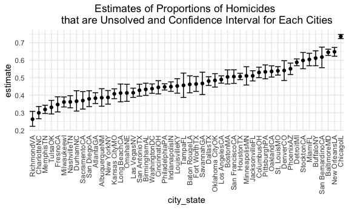

Homework 5
================
mm5951
2022-11-08

## Problem 1

Solutions provided by teaching team.

## Problem 2

### Data wrangling & description

Prompt: Describe the raw data. Create a city_state variable
(e.g. “Baltimore, MD”) and then summarize within cities to obtain the
total number of homicides and the number of unsolved homicides (those
for which the disposition is “Closed without arrest” or “Open/No
arrest”).

``` r
homicide_df = read.csv("./data/homicide-data.csv", na = c("","Unknown")) %>% 
  mutate(city_state = str_c(city, state),
         resolution = case_when(
           disposition == "Closed without arrest" ~ "unsolved",
           disposition == "Open/No arrest" ~ "unsolved",
           disposition == "Closed by arrest" ~ "solved"
         )) %>% 
  relocate(city_state) %>% 
  filter(city_state != "TulsaAL")
```

### Baltimore city estimates

Prompt: For the city of Baltimore, MD, use the prop.test function to
estimate the proportion of homicides that are unsolved; save the output
of prop.test as an R object, apply the broom::tidy to this object and
pull the estimated proportion and confidence intervals from the
resulting tidy dataframe.

``` r
baltimore_df = homicide_df %>% 
  filter(city_state == "BaltimoreMD")
baltimore_summary = 
  baltimore_df %>% 
  summarize(
    unsolved = sum(resolution == "unsolved"),
    n = n()
  )
baltimore_test = prop.test(
  x = baltimore_summary %>% pull(unsolved), 
  n = baltimore_summary %>% pull(n))
baltimore_test %>% 
  broom::tidy()
```

    ## # A tibble: 1 × 8
    ##   estimate statistic  p.value parameter conf.low conf.high method        alter…¹
    ##      <dbl>     <dbl>    <dbl>     <int>    <dbl>     <dbl> <chr>         <chr>  
    ## 1    0.646      239. 6.46e-54         1    0.628     0.663 1-sample pro… two.si…
    ## # … with abbreviated variable name ¹​alternative

### Iteration on multiple cities estimates

Prompt: Now run prop.test for each of the cities in your dataset, and
extract both the proportion of unsolved homicides and the confidence
interval for each. Do this within a “tidy” pipeline, making use of
purrr::map, purrr::map2, list columns and unnest as necessary to create
a tidy dataframe with estimated proportions and CIs for each city.

First, Write a function.

``` r
prop_test_function = function(city_df) {
  
  city_summary = 
    city_df %>% 
    summarize(
      unsolved = sum(resolution == "unsolved"),
      n = n()
    )
  
  city_test = prop.test(
    x = city_summary %>% pull(unsolved), 
    n = city_summary %>% pull(n))
  
  return(city_test)
}
```

Second, iterate across all cities.

``` r
results_df = 
  homicide_df %>% 
  nest(data = uid:resolution) %>% 
  mutate(
    test_results = map(data, prop_test_function),
    tidy_results = map(test_results, broom::tidy)
  ) %>% 
  select(city_state, tidy_results) %>% 
  unnest(tidy_results) %>% 
  select(city_state, estimate, starts_with("conf"))
```

### Data visualization

Prompt: Create a plot that shows the estimates and CIs for each city –
check out geom_errorbar for a way to add error bars based on the upper
and lower limits. Organize cities according to the proportion of
unsolved homicides.

Make a plot showing estimates and confidence intervals for each cities
and organize cities according to the proportion of unsolved homicides.

``` r
results_df %>% 
  mutate(city_state = fct_reorder(city_state, estimate)) %>% 
  ggplot(aes(x = city_state, y = estimate)) +
  geom_point() +
  geom_errorbar(aes(ymin = conf.low, ymax = conf.high)) +
  labs(title = "Estimates of Proportions of Homicides 
       that are Unsolved and Confidence Interval for Each Cities") +
  theme(axis.text.x = element_text(angle = 90, vjust = 0.5, hjust = 1),
        plot.title = element_text(hjust = 0.5))
```



## Problem 3

To be completed
