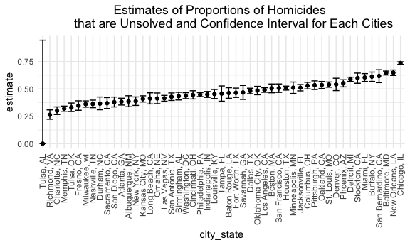

Homework 5
================
mm5951
2022-11-10

## Problem 1

Solutions provided by teaching team.

## Problem 2

### Data wrangling & description

I first describe the raw data using the `str()` and `skimr::skim()`
functions.

``` r
homicide_df_raw = read_csv("./data/homicide-data.csv")
```

    ## Rows: 52179 Columns: 12
    ## ── Column specification ────────────────────────────────────────────────────────
    ## Delimiter: ","
    ## chr (9): uid, victim_last, victim_first, victim_race, victim_age, victim_sex...
    ## dbl (3): reported_date, lat, lon
    ## 
    ## ℹ Use `spec()` to retrieve the full column specification for this data.
    ## ℹ Specify the column types or set `show_col_types = FALSE` to quiet this message.

``` r
str(homicide_df_raw)
```

    ## spc_tbl_ [52,179 × 12] (S3: spec_tbl_df/tbl_df/tbl/data.frame)
    ##  $ uid          : chr [1:52179] "Alb-000001" "Alb-000002" "Alb-000003" "Alb-000004" ...
    ##  $ reported_date: num [1:52179] 20100504 20100216 20100601 20100101 20100102 ...
    ##  $ victim_last  : chr [1:52179] "GARCIA" "MONTOYA" "SATTERFIELD" "MENDIOLA" ...
    ##  $ victim_first : chr [1:52179] "JUAN" "CAMERON" "VIVIANA" "CARLOS" ...
    ##  $ victim_race  : chr [1:52179] "Hispanic" "Hispanic" "White" "Hispanic" ...
    ##  $ victim_age   : chr [1:52179] "78" "17" "15" "32" ...
    ##  $ victim_sex   : chr [1:52179] "Male" "Male" "Female" "Male" ...
    ##  $ city         : chr [1:52179] "Albuquerque" "Albuquerque" "Albuquerque" "Albuquerque" ...
    ##  $ state        : chr [1:52179] "NM" "NM" "NM" "NM" ...
    ##  $ lat          : num [1:52179] 35.1 35.1 35.1 35.1 35.1 ...
    ##  $ lon          : num [1:52179] -107 -107 -107 -107 -107 ...
    ##  $ disposition  : chr [1:52179] "Closed without arrest" "Closed by arrest" "Closed without arrest" "Closed by arrest" ...
    ##  - attr(*, "spec")=
    ##   .. cols(
    ##   ..   uid = col_character(),
    ##   ..   reported_date = col_double(),
    ##   ..   victim_last = col_character(),
    ##   ..   victim_first = col_character(),
    ##   ..   victim_race = col_character(),
    ##   ..   victim_age = col_character(),
    ##   ..   victim_sex = col_character(),
    ##   ..   city = col_character(),
    ##   ..   state = col_character(),
    ##   ..   lat = col_double(),
    ##   ..   lon = col_double(),
    ##   ..   disposition = col_character()
    ##   .. )
    ##  - attr(*, "problems")=<externalptr>

``` r
skimr::skim(homicide_df_raw)
```

|                                                  |                 |
|:-------------------------------------------------|:----------------|
| Name                                             | homicide_df_raw |
| Number of rows                                   | 52179           |
| Number of columns                                | 12              |
| \_\_\_\_\_\_\_\_\_\_\_\_\_\_\_\_\_\_\_\_\_\_\_   |                 |
| Column type frequency:                           |                 |
| character                                        | 9               |
| numeric                                          | 3               |
| \_\_\_\_\_\_\_\_\_\_\_\_\_\_\_\_\_\_\_\_\_\_\_\_ |                 |
| Group variables                                  | None            |

Data summary

**Variable type: character**

| skim_variable | n_missing | complete_rate | min | max | empty | n_unique | whitespace |
|:--------------|----------:|--------------:|----:|----:|------:|---------:|-----------:|
| uid           |         0 |             1 |   9 |  10 |     0 |    52179 |          0 |
| victim_last   |         0 |             1 |   1 |  20 |     0 |    12687 |          0 |
| victim_first  |         0 |             1 |   1 |  28 |     0 |    16640 |          0 |
| victim_race   |         0 |             1 |   5 |   8 |     0 |        6 |          0 |
| victim_age    |         0 |             1 |   1 |   7 |     0 |      102 |          0 |
| victim_sex    |         0 |             1 |   4 |   7 |     0 |        3 |          0 |
| city          |         0 |             1 |   5 |  14 |     0 |       50 |          0 |
| state         |         0 |             1 |   2 |   2 |     0 |       28 |          0 |
| disposition   |         0 |             1 |  14 |  21 |     0 |        3 |          0 |

**Variable type: numeric**

| skim_variable | n_missing | complete_rate |        mean |         sd |          p0 |         p25 |         p50 |         p75 |          p100 | hist  |
|:--------------|----------:|--------------:|------------:|-----------:|------------:|------------:|------------:|------------:|--------------:|:------|
| reported_date |         0 |             1 | 20130899.16 | 1123419.63 | 20070101.00 | 20100318.00 | 20121216.00 | 20150911.00 | 201511105\.00 | ▇▁▁▁▁ |
| lat           |        60 |             1 |       37.03 |       4.35 |       25.73 |       33.77 |       38.52 |       40.03 |         45.05 | ▁▅▅▇▅ |
| lon           |        60 |             1 |      -91.47 |      13.75 |     -122.51 |      -96.00 |      -87.71 |      -81.76 |        -71.01 | ▃▁▃▇▅ |

The “homicide_df_raw” dataset contains 12 variables and 52179
observations. Details on the nature of its variables and summary values
are found in the outputs above.

Then, I import the dataset using `read_csv()`, drop empty observations
(““,”na”, “Unknown”) and wrangle data as per problem instructions. This
includes:

- Create a new “city_state” variable (e.g. “Baltimore, MD”) with
  `mutate()` and order by alphabetical orden using `str_c()`.
- Create a new “resolution” variable using the `case_when()` syntaxis,
  indicating whehter a case is resolved or not (those for which the
  disposition is “Closed without arrest” or “Open/No arrest”).

``` r
homicide_df = read_csv("./data/homicide-data.csv", na = c("","Unknown")) %>% 
  mutate(city_state = str_c(city, state, sep = ", "),
         resolution = case_when(
           disposition == "Closed without arrest" ~ "unsolved",
           disposition == "Open/No arrest" ~ "unsolved",
           disposition == "Closed by arrest" ~ "solved"
         )) %>% 
  relocate(city_state) %>% 
  filter(city_state != "TulsaAL")
```

    ## Rows: 52179 Columns: 12
    ## ── Column specification ────────────────────────────────────────────────────────
    ## Delimiter: ","
    ## chr (8): uid, victim_last, victim_first, victim_race, victim_sex, city, stat...
    ## dbl (4): reported_date, victim_age, lat, lon
    ## 
    ## ℹ Use `spec()` to retrieve the full column specification for this data.
    ## ℹ Specify the column types or set `show_col_types = FALSE` to quiet this message.

**PENDING** : Then summarize within cities to obtain the total number of
homicides and the number of unsolved homicides.

### Baltimore city estimates

Prompt: For the city of Baltimore, MD, use the prop.test function to
estimate the proportion of homicides that are unsolved; save the output
of prop.test as an R object, apply the broom::tidy to this object and
pull the estimated proportion and confidence intervals from the
resulting tidy dataframe.

``` r
baltimore_df = homicide_df %>% 
  filter(city_state == "Baltimore, MD")
baltimore_summary = 
  baltimore_df %>% 
  summarize(
    unsolved = sum(resolution == "unsolved"),
    n = n()
  )
baltimore_test = prop.test(
  x = baltimore_summary %>% pull(unsolved), 
  n = baltimore_summary %>% pull(n))
baltimore_test %>% 
  broom::tidy()
```

    ## # A tibble: 1 × 8
    ##   estimate statistic  p.value parameter conf.low conf.high method        alter…¹
    ##      <dbl>     <dbl>    <dbl>     <int>    <dbl>     <dbl> <chr>         <chr>  
    ## 1    0.646      239. 6.46e-54         1    0.628     0.663 1-sample pro… two.si…
    ## # … with abbreviated variable name ¹​alternative

### Iteration on multiple cities estimates

Prompt: Now run prop.test for each of the cities in your dataset, and
extract both the proportion of unsolved homicides and the confidence
interval for each. Do this within a “tidy” pipeline, making use of
purrr::map, purrr::map2, list columns and unnest as necessary to create
a tidy dataframe with estimated proportions and CIs for each city.

First, Write a function.

``` r
prop_test_function = function(city_df) {
  
  city_summary = 
    city_df %>% 
    summarize(
      unsolved = sum(resolution == "unsolved"),
      n = n()
    )
  
  city_test = prop.test(
    x = city_summary %>% pull(unsolved), 
    n = city_summary %>% pull(n))
  
  return(city_test)
}
```

Second, iterate across all cities.

``` r
results_df = 
  homicide_df %>% 
  nest(data = uid:resolution) %>% 
  mutate(
    test_results = map(data, prop_test_function),
    tidy_results = map(test_results, broom::tidy)
  ) %>% 
  select(city_state, tidy_results) %>% 
  unnest(tidy_results) %>% 
  select(city_state, estimate, starts_with("conf"))
```

### Data visualization

Prompt: Create a plot that shows the estimates and CIs for each city –
check out geom_errorbar for a way to add error bars based on the upper
and lower limits. Organize cities according to the proportion of
unsolved homicides.

Make a plot showing estimates and confidence intervals for each cities
and organize cities according to the proportion of unsolved homicides.

``` r
results_df %>% 
  mutate(city_state = fct_reorder(city_state, estimate)) %>% 
  ggplot(aes(x = city_state, y = estimate)) +
  geom_point() +
  geom_errorbar(aes(ymin = conf.low, ymax = conf.high)) +
  labs(title = "Estimates of Proportions of Homicides 
       that are Unsolved and Confidence Interval for Each Cities") +
  theme(axis.text.x = element_text(angle = 90, vjust = 0.5, hjust = 1),
        plot.title = element_text(hjust = 0.5))
```



## Problem 3

To be completed
