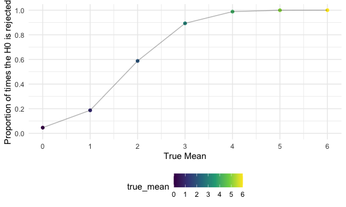
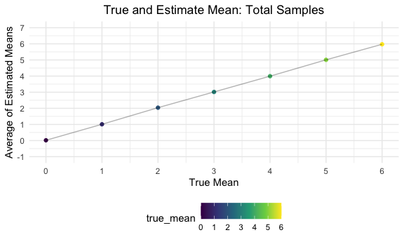

Homework 5
================
mm5951
2022-11-16

## Problem 1

Solutions provided by teaching team.

## Problem 2

### Data wrangling & description

First, I import the dataset using `read_csv()` and rename empty
observations to “na” (““,”Unknown”). To describe the raw data, I use the
`skimr::skim()` function.

``` r
homicide_df_raw = read_csv("./data/homicide-data.csv", na = c("","Unknown"))

skimr::skim(homicide_df_raw)
```

|                                                  |                 |
|:-------------------------------------------------|:----------------|
| Name                                             | homicide_df_raw |
| Number of rows                                   | 52179           |
| Number of columns                                | 12              |
| \_\_\_\_\_\_\_\_\_\_\_\_\_\_\_\_\_\_\_\_\_\_\_   |                 |
| Column type frequency:                           |                 |
| character                                        | 8               |
| numeric                                          | 4               |
| \_\_\_\_\_\_\_\_\_\_\_\_\_\_\_\_\_\_\_\_\_\_\_\_ |                 |
| Group variables                                  | None            |

Data summary

**Variable type: character**

| skim_variable | n_missing | complete_rate | min | max | empty | n_unique | whitespace |
|:--------------|----------:|--------------:|----:|----:|------:|---------:|-----------:|
| uid           |         0 |          1.00 |   9 |  10 |     0 |    52179 |          0 |
| victim_last   |      5764 |          0.89 |   1 |  20 |     0 |    12686 |          0 |
| victim_first  |      5762 |          0.89 |   1 |  28 |     0 |    16639 |          0 |
| victim_race   |      4199 |          0.92 |   5 |   8 |     0 |        5 |          0 |
| victim_sex    |      4231 |          0.92 |   4 |   6 |     0 |        2 |          0 |
| city          |         0 |          1.00 |   5 |  14 |     0 |       50 |          0 |
| state         |         0 |          1.00 |   2 |   2 |     0 |       28 |          0 |
| disposition   |         0 |          1.00 |  14 |  21 |     0 |        3 |          0 |

**Variable type: numeric**

| skim_variable | n_missing | complete_rate |        mean |         sd |          p0 |         p25 |         p50 |         p75 |          p100 | hist  |
|:--------------|----------:|--------------:|------------:|-----------:|------------:|------------:|------------:|------------:|--------------:|:------|
| reported_date |         0 |          1.00 | 20130899.16 | 1123419.63 | 20070101.00 | 20100318.00 | 20121216.00 | 20150911.00 | 201511105\.00 | ▇▁▁▁▁ |
| victim_age    |      2999 |          0.94 |       31.80 |      14.42 |        0.00 |       22.00 |       28.00 |       40.00 |        102.00 | ▃▇▃▁▁ |
| lat           |        60 |          1.00 |       37.03 |       4.35 |       25.73 |       33.77 |       38.52 |       40.03 |         45.05 | ▁▅▅▇▅ |
| lon           |        60 |          1.00 |      -91.47 |      13.75 |     -122.51 |      -96.00 |      -87.71 |      -81.76 |        -71.01 | ▃▁▃▇▅ |

The “homicide_df_raw” dataset contains 12 variables and 52179
observations. Details on the nature of its variables and summary values
are found in the outputs above.

Then, I wrangle data as per problem instructions. This includes:

- Create a new “city_state” variable (e.g. “Baltimore, MD”) with
  `mutate()` and order by alphabetical orden using `str_c()`.
- Create a new “resolution” variable using the `case_when()` syntaxis,
  indicating whehter a case is resolved or not (those for which the
  disposition is “Closed without arrest” or “Open/No arrest”).
- Note one entry “Tulsa, AL” is excluded using `filter()`, as it is
  unclear whether it refers to Tulsa, Oklahoma or Birmingham, Alabama
  (this entry becomes apparent on the next section, under the
  “US_summary” data frame, and is then retroactively amended).

``` r
homicide_df = homicide_df_raw %>% 
  mutate(city_state = str_c(city, state, sep = ", "),
         resolution = case_when(
           disposition == "Closed without arrest" ~ "unsolved",
           disposition == "Open/No arrest" ~ "unsolved",
           disposition == "Closed by arrest" ~ "solved"
         )) %>% 
  relocate(city_state) %>% 
  filter(city_state != "Tulsa, AL")
```

Then, I summarize within cities using `group_by()` to obtain the total
number of homicides (“n”) and the number of unsolved homicides
(“unsolved”) in a table using `knitr::kable()`.

``` r
US_summary = 
  homicide_df %>% 
  group_by(city_state) %>% 
  summarize(
    n = n(),
    unsolved = sum(resolution == "unsolved"),
      ) %>% 
  knitr::kable()

US_summary
```

| city_state         |    n | unsolved |
|:-------------------|-----:|---------:|
| Albuquerque, NM    |  378 |      146 |
| Atlanta, GA        |  973 |      373 |
| Baltimore, MD      | 2827 |     1825 |
| Baton Rouge, LA    |  424 |      196 |
| Birmingham, AL     |  800 |      347 |
| Boston, MA         |  614 |      310 |
| Buffalo, NY        |  521 |      319 |
| Charlotte, NC      |  687 |      206 |
| Chicago, IL        | 5535 |     4073 |
| Cincinnati, OH     |  694 |      309 |
| Columbus, OH       | 1084 |      575 |
| Dallas, TX         | 1567 |      754 |
| Denver, CO         |  312 |      169 |
| Detroit, MI        | 2519 |     1482 |
| Durham, NC         |  276 |      101 |
| Fort Worth, TX     |  549 |      255 |
| Fresno, CA         |  487 |      169 |
| Houston, TX        | 2942 |     1493 |
| Indianapolis, IN   | 1322 |      594 |
| Jacksonville, FL   | 1168 |      597 |
| Kansas City, MO    | 1190 |      486 |
| Las Vegas, NV      | 1381 |      572 |
| Long Beach, CA     |  378 |      156 |
| Los Angeles, CA    | 2257 |     1106 |
| Louisville, KY     |  576 |      261 |
| Memphis, TN        | 1514 |      483 |
| Miami, FL          |  744 |      450 |
| Milwaukee, wI      | 1115 |      403 |
| Minneapolis, MN    |  366 |      187 |
| Nashville, TN      |  767 |      278 |
| New Orleans, LA    | 1434 |      930 |
| New York, NY       |  627 |      243 |
| Oakland, CA        |  947 |      508 |
| Oklahoma City, OK  |  672 |      326 |
| Omaha, NE          |  409 |      169 |
| Philadelphia, PA   | 3037 |     1360 |
| Phoenix, AZ        |  914 |      504 |
| Pittsburgh, PA     |  631 |      337 |
| Richmond, VA       |  429 |      113 |
| Sacramento, CA     |  376 |      139 |
| San Antonio, TX    |  833 |      357 |
| San Bernardino, CA |  275 |      170 |
| San Diego, CA      |  461 |      175 |
| San Francisco, CA  |  663 |      336 |
| Savannah, GA       |  246 |      115 |
| St. Louis, MO      | 1677 |      905 |
| Stockton, CA       |  444 |      266 |
| Tampa, FL          |  208 |       95 |
| Tulsa, OK          |  583 |      193 |
| Washington, DC     | 1345 |      589 |

### Baltimore city estimates

Next, I use the `prop.test` function to perform a test of equal
proportions *(that is, testing the null that the proportions
(probabilities of success) in several groups are the same, or that they
equal certain given values.)*

More specifically, for the city of Baltimore, MD, I estimate the
**proportion of homicides that are unsolved**. To do so, first a summary
dataframe is generated containing the sum of “unsolved” crimes and the
overall sample size (“n”). Then, A “baltimore_test” R object (a list) is
generated as an output of the `prop.test`, to which then I apply
`broom::tidy`. It contains the estimated proportion and confidence
intervals from the test of equal proportions.

``` r
baltimore_df = homicide_df %>% 
  filter(city_state == "Baltimore, MD")

baltimore_summary = 
  baltimore_df %>% 
  summarize(
    unsolved = sum(resolution == "unsolved"),
    n = n()
  )

baltimore_test = prop.test(
  x = baltimore_summary %>% pull(unsolved), 
  n = baltimore_summary %>% pull(n)) 

baltimore_test %>% 
  broom::tidy()
```

    ## # A tibble: 1 × 8
    ##   estimate statistic  p.value parameter conf.low conf.high method        alter…¹
    ##      <dbl>     <dbl>    <dbl>     <int>    <dbl>     <dbl> <chr>         <chr>  
    ## 1    0.646      239. 6.46e-54         1    0.628     0.663 1-sample pro… two.si…
    ## # … with abbreviated variable name ¹​alternative

As a result of this test, Baltimore, MD has a proportion of 0.646
(0.628, 0.663) unresolved crimes.

### Iteration on multiple cities estimates

Next, I run the `prop.test()` for each of the cities in the
“homicide_df” dataset. To extract both the proportion of unsolved
homicides and the confidence interval for each of the cities, I follow a
“tidy” pipeline which entails:.

1.  **Writing a function that runs the `prop.test()` in each of the
    cities**. The `prop_test_unresolved` uses the “US_summary” created
    above (without the `knitr::kable()` chunk) and a similar structure
    to the equal proportions test applied to Baltimore, MD.

``` r
prop_test_unresolved = function(homicide_df) {
  
  cities_summary = 
  homicide_df %>% 
  summarize(
    n = n(),
    unsolved = sum(resolution == "unsolved"),
      )
  
  city_test = prop.test(
    x = cities_summary %>% pull(unsolved), 
    n = cities_summary %>% pull(n))
  
  return(city_test)
}
```

2.  **Iterating across all cities**. To do so, the data is first nested,
    then `purrr::map()` is applied indicating the list (“data”) I
    iterate over, and the function to apply (`prop_test_homicide()`.
    Then, a “tidy_results” object is generated with the results, which
    is then unnested to select the variables of interest (“city_state”,
    “estimate”, and confidence intervals (CI)). Results are visualized
    below using `knitr::kable()`.

``` r
results_df = 
  homicide_df %>% 
  nest(data = uid:resolution) %>% 
  mutate(
    test_results = map(data, prop_test_unresolved),
    tidy_results = map(test_results, broom::tidy)
  ) %>% 
  select(city_state, tidy_results) %>% 
  unnest(tidy_results) %>% 
  select(city_state, estimate, starts_with("conf"))

results_df %>% 
  knitr::kable(digits = 3)
```

| city_state         | estimate | conf.low | conf.high |
|:-------------------|---------:|---------:|----------:|
| Albuquerque, NM    |    0.386 |    0.337 |     0.438 |
| Atlanta, GA        |    0.383 |    0.353 |     0.415 |
| Baltimore, MD      |    0.646 |    0.628 |     0.663 |
| Baton Rouge, LA    |    0.462 |    0.414 |     0.511 |
| Birmingham, AL     |    0.434 |    0.399 |     0.469 |
| Boston, MA         |    0.505 |    0.465 |     0.545 |
| Buffalo, NY        |    0.612 |    0.569 |     0.654 |
| Charlotte, NC      |    0.300 |    0.266 |     0.336 |
| Chicago, IL        |    0.736 |    0.724 |     0.747 |
| Cincinnati, OH     |    0.445 |    0.408 |     0.483 |
| Columbus, OH       |    0.530 |    0.500 |     0.560 |
| Dallas, TX         |    0.481 |    0.456 |     0.506 |
| Denver, CO         |    0.542 |    0.485 |     0.598 |
| Detroit, MI        |    0.588 |    0.569 |     0.608 |
| Durham, NC         |    0.366 |    0.310 |     0.426 |
| Fort Worth, TX     |    0.464 |    0.422 |     0.507 |
| Fresno, CA         |    0.347 |    0.305 |     0.391 |
| Houston, TX        |    0.507 |    0.489 |     0.526 |
| Indianapolis, IN   |    0.449 |    0.422 |     0.477 |
| Jacksonville, FL   |    0.511 |    0.482 |     0.540 |
| Kansas City, MO    |    0.408 |    0.380 |     0.437 |
| Las Vegas, NV      |    0.414 |    0.388 |     0.441 |
| Long Beach, CA     |    0.413 |    0.363 |     0.464 |
| Los Angeles, CA    |    0.490 |    0.469 |     0.511 |
| Louisville, KY     |    0.453 |    0.412 |     0.495 |
| Memphis, TN        |    0.319 |    0.296 |     0.343 |
| Miami, FL          |    0.605 |    0.569 |     0.640 |
| Milwaukee, wI      |    0.361 |    0.333 |     0.391 |
| Minneapolis, MN    |    0.511 |    0.459 |     0.563 |
| Nashville, TN      |    0.362 |    0.329 |     0.398 |
| New Orleans, LA    |    0.649 |    0.623 |     0.673 |
| New York, NY       |    0.388 |    0.349 |     0.427 |
| Oakland, CA        |    0.536 |    0.504 |     0.569 |
| Oklahoma City, OK  |    0.485 |    0.447 |     0.524 |
| Omaha, NE          |    0.413 |    0.365 |     0.463 |
| Philadelphia, PA   |    0.448 |    0.430 |     0.466 |
| Phoenix, AZ        |    0.551 |    0.518 |     0.584 |
| Pittsburgh, PA     |    0.534 |    0.494 |     0.573 |
| Richmond, VA       |    0.263 |    0.223 |     0.308 |
| San Antonio, TX    |    0.429 |    0.395 |     0.463 |
| Sacramento, CA     |    0.370 |    0.321 |     0.421 |
| Savannah, GA       |    0.467 |    0.404 |     0.532 |
| San Bernardino, CA |    0.618 |    0.558 |     0.675 |
| San Diego, CA      |    0.380 |    0.335 |     0.426 |
| San Francisco, CA  |    0.507 |    0.468 |     0.545 |
| St. Louis, MO      |    0.540 |    0.515 |     0.564 |
| Stockton, CA       |    0.599 |    0.552 |     0.645 |
| Tampa, FL          |    0.457 |    0.388 |     0.527 |
| Tulsa, OK          |    0.331 |    0.293 |     0.371 |
| Washington, DC     |    0.438 |    0.411 |     0.465 |

### Data visualization

Finally, results as above are summarised in a plot that shows the
estimates and CIs for each city. In doing so:

- Cities are reordered by estimate of unresolved crimes using
  `fct_reorder()`;
- Data is visualized using `ggplot()` and the scatterplot
  `geom_point()`;
- CIs are visualized using `geom_errorbar()`

``` r
results_df %>% 
  mutate(city_state = fct_reorder(city_state, estimate)) %>% 
  ggplot(aes(x = city_state, y = estimate)) +
  geom_point() +
  geom_errorbar(aes(ymin = conf.low, ymax = conf.high)) +
  labs(
    title = "Estimated proportion of unresolved homicides and CI",
    x = "City, State",
    y = "Estimate")+
  theme(axis.text.x = element_text(angle = 90, vjust = 0.5, hjust = 1),
        plot.title = element_text(hjust = 0.5))
```


Note Chicago is an outlier, with a higher proportion of unresolved
homicides (above 70%), when compared to the rest of US cities.

## Problem 3

**PROMPT:** *When designing an experiment or analysis, a common question
is whether it is likely that a true effect will be detected – put
differently, whether a false null hypothesis will be rejected. The
probability that a false null hypothesis is rejected is referred to as
power, and it depends on several factors, including: the sample size;
the effect size; and the error variance. In this problem, you will
conduct a simulation to explore power in a one-sample t-test.*

### Dataset generation

First, I generate a “raw dataset” with the indicated sample size (n=30),
mean (μ=0) and standard deviation (σ=5):

``` r
raw_dataset = rnorm(30, 0, 5) %>% 
  as_tibble()
```

Next, through repeated sampling I generate 5,000 datasets. In order to
do so, I will:

- create a function `norm_dataset()` that generates a dataset following
  a normal distribution x∼Normal\[μ,σ\] with the pre-set n, sd and
  true_mean;
- generate a “output” object which contains 5,000 lists (iterations) for
  each pre-set mean (0:6) with fixed sample size of n=30, and columns
  for the “true_mean”, “sample_mean” and “p_value”;
- create a `combine_function()` that runs a one-sample t-test using
  α=0.05 (`t.test()` within `broom::tidy()`) in each of the samples;
- generate a “result” object which contains 7 lists, one for each
  pre-set mean (0:6).

``` r
n = 30
sd = 5
true_mean = 0:6

norm_dataset = function(x) {
  rnorm(n, x, sd)}

output = vector("list", length = 5000)
inter <- data.frame(matrix(ncol = 3, nrow = 5000))
colnames(inter) <- c('true_mean', 'sample_mean', 'p-value')


combine_function = function(y){
  inter2 = list()
  for (i in 1:50) {
    output[[i]] = norm_dataset(y)
    a = broom::tidy(t.test(output[[i]]))
    inter[i,1] = y
    inter[i,2] = a[[1]]
    inter[i,3] = a[[3]]}
  inter2 = rbind(inter2, inter)}

result = map(true_mean, combine_function)
```

Finally, I generate a “result_df” dataframe that contains each of the
5,000 samples for the 7 given means (0:7), with the estimated sample
mean, the t-test p-value result, and whether the null hypothesis is
rejected (p\<0.05) or not (p\>=0.05).

``` r
result_df = data.frame(c(1:5000),result[[1]])
for (i in 2:7) {
  df = data.frame(c(1:5000),result[[i]])
  result_df = rbind(result_df, df)
}

result_df = result_df %>%
  mutate(reject = ifelse(p.value < 0.05, TRUE, FALSE))
```

### Data visualization

Next, I make a plot showing the **proportion of times the null (H0) was
rejected on the y axis and the true value of μ on the x axis**.

``` r
power_plot = result_df %>%
  group_by(true_mean) %>% 
  summarize(power = sum(reject)/50) %>% 
  ggplot(aes(x = true_mean, y = power)) +
  geom_point(aes(colour = true_mean)) +
  geom_line(alpha = 0.3) +
  labs(x = "True Mean", 
       y = "Proportion of times the H0 is rejected") +
  scale_x_continuous(breaks = seq(0,6,by = 1)) +
  scale_y_continuous(limits = c(0,1), breaks = seq(0,1,by = 0.2))

power_plot
```



The lower the true mean, the lower the proportion of times that the null
hypothesis was rejected. That means, if the effect size of the
intervention is large, it is possible to detect such an effect in
smaller sample numbers, whereas a smaller effect size would require
larger sample sizes.

Next, I make another plot showing the **average estimate of μ̂ on the y
axis and the true value of μ on the x axis**. Note that the direct
relationship shows that the average repeated samples mean is quite
approximate to the true mean.

``` r
means_plot = result_df %>%
  group_by(true_mean) %>%
  summarize(mean_sample = mean(sample_mean)) %>%
  ggplot(aes(x = true_mean, y = mean_sample)) +
  geom_point(aes(colour = true_mean)) +
  geom_line(alpha = 0.3) +
  labs(title = "True and Estimate Mean: Total Samples",
       x = "True Mean", 
       y = "Average of Estimated Means") +
  scale_x_continuous(limits = c(0,6), breaks = seq(0,6,1)) +
  scale_y_continuous(limits = c(-1,7), breaks = seq(-1,7,1)) +
  theme(plot.title = element_text(hjust = 0.5))

means_plot
```



Finally, I make one last plot showing the **average estimate of μ̂ only
in samples for which the null was rejected on the y axis and the true
value of μ on the x axis**.

``` r
means_reject = result_df %>%
  group_by(true_mean) %>%
  filter(p.value < 0.05) %>%
  summarize(mean_sample = mean(sample_mean)) %>%
  ggplot(aes(x = true_mean, y = mean_sample)) +
  geom_point(aes(colour = true_mean)) +
  geom_line(alpha = 0.3) +
  labs(title = "True and Estimate Mean: Rejected H0 Samples",
       x = "True Mean", 
       y = "Average of Estimated Means") +
  scale_x_continuous(limits = c(0,6), breaks = seq(0,6,1)) +
  scale_y_continuous(limits = c(-1,7), breaks = seq(-1,7,1)) +
  theme(plot.title = element_text(hjust = 0.5))

means_reject
```


Note the sample average of μ̂ across tests for which the null (H0) is
rejected is not always equal to the true value of μ (especially for true
means 0:2). That is related to the effect size and power relation that
was depicted above: the smaller the effect size, the bigger power that
it is required to reject the null hypothesis. With a fix sample size, in
this example it becomes apparent how the estimated mean and true mean do
not match for smaller values, but quite accurately do for bigger ones.

*That’s it for homework 5!*
